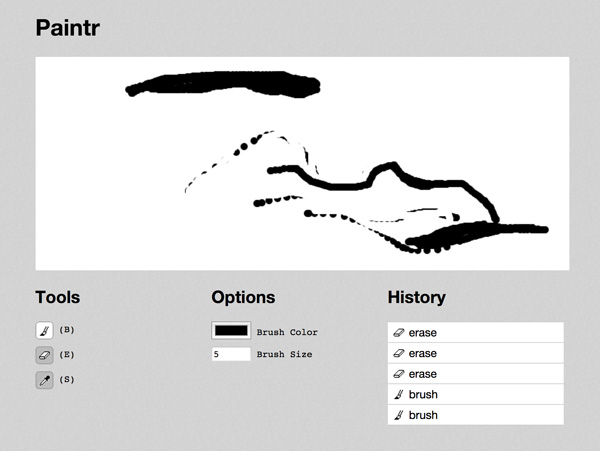

# Paintr

A simple canvas-based paint app. Features include:

- Brush, eraser, and eye dropper tools.
- Paint color and brush size settings.
- Version history.
- Keyboard shortcuts.




This app is an excercise in thinking about the components that manage a data-driven application. Intended for instructional use.

## Setup

This app is built in Middleman. To run, do:

```
cd paintr
bundle install
bundle exec middleman
```

The app should now be running at `localhost:4567`

To build a static version of the app with flat HTML, CSS, and minified JavaScript, do:

```
bundle exec middleman build
```

This will generate a `build` directory with the static app compiled into it.